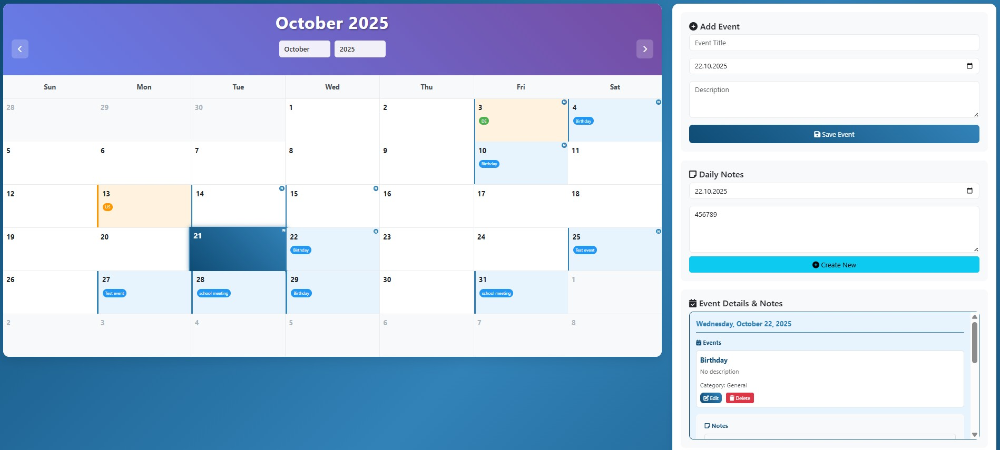
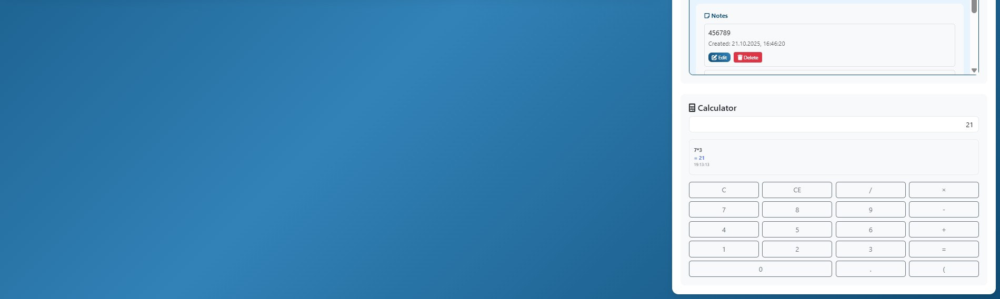

# Calendar Web App

A modern, feature-rich web-based calendar application built with Flask, featuring event tracking, holiday support, daily notes, and a built-in calculator with a beautiful ocean-themed design.





## Features

### 📅 Interactive Calendar
- Monthly calendar view with beautiful ocean-themed design
- Visual indicators for events, holidays, and notes
- Click to select dates and view all information
- Easy navigation between months/years
- Real-time updates without page refresh

### 📝 Event Management
- Create, edit, and delete events with titles, descriptions, and times
- Color-coded event categories
- All-day event option
- Delete events with confirmation
- Success notifications with green checkmarks

### 🌍 Holiday Support
- Multi-country holiday support including:
  - United States (US) - Orange indicators
  - Germany (DE) - Green indicators
- Visual distinction between holidays and regular events
- Full holiday names displayed on hover

### 📖 Daily Notes
- Rich text editor for daily notes/journal entries
- Auto-save functionality
- Date-based note organization
- Visual indicators on calendar days
- Dedicated note display section
- Delete notes with confirmation

### 🧮 Calculator
- Arithmetic calculator with standard operations (+, -, ×, ÷)
- Calculation history display
- Real-time expression building
- Operators display correctly in input box
- Error handling for invalid expressions

### 🎨 Modern UI/UX
- Beautiful ocean-themed design with deep blue gradients
- Responsive layout that works on all devices
- Smooth animations and transitions
- Success messages instead of popup alerts
- Professional-grade user experience

## Installation

### Prerequisites
- Python 3.8 or higher
- pip package manager

### Setup
1. Clone or download this repository
2. Install required dependencies:
   ```bash
   pip install -r requirements.txt
   ```
3. Run the web application:
   ```bash
   python run_web_app.py
   ```
   Or use the batch file:
   ```bash
   start_web_app.bat
   ```
4. Open your browser and go to: `http://localhost:5000`

## Dependencies

- **Flask**: Web framework for the application
- **SQLAlchemy**: Database ORM for data persistence
- **holidays**: Holiday data for multiple countries
- **pytz**: Timezone support
- **python-dateutil**: Date parsing utilities
- **Werkzeug**: WSGI utilities

## Project Structure

```
Calender_app/
├── web_app.py                    # Flask web application
├── run_web_app.py               # Application launcher
├── start_web_app.bat            # Windows batch launcher
├── requirements.txt              # Dependencies
├── README.md                     # This file
├── WEB_APP_README.md            # Web app specific documentation
├── BUG_FIXES_SUMMARY.md         # Bug fixes documentation
├── database/
│   ├── __init__.py
│   ├── db_manager.py            # Database operations
│   └── models.py                # Data models
├── static/
│   └── calendar.js              # Frontend JavaScript
├── templates/
│   └── calendar.html            # Main HTML template
└── utils/
    ├── __init__.py
    ├── holiday_manager.py       # Holiday data management
    ├── timezone_manager.py      # Timezone operations
    └── settings.py              # App settings/config
```

## Usage

### Getting Started
1. Launch the web application
2. Open your browser to `http://localhost:5000`
3. The calendar will load with current month
4. Start creating events and notes!

### Creating Events
1. Click on a date in the calendar
2. Fill in the event form in the sidebar
3. Click "Save Event"
4. See the green checkmark success message
5. Event appears on the calendar immediately

### Managing Notes
1. Click on a date in the calendar
2. Write your note in the textarea
3. Click "Save Note"
4. See the green checkmark success message
5. Note appears in the dedicated display section
6. Visual "N" indicator appears on the calendar day

### Using Calculator
1. Use the calculator in the sidebar
2. Enter numbers and operators
3. Operators display correctly in the input box
4. Click "=" to calculate
5. View calculation history below

### Viewing Event Details
1. Click on any calendar day
2. Modal opens showing all events, holidays, and notes for that date
3. Edit or delete events and notes directly from the modal
4. Modal positioned to not cover the calendar

## Data Storage

The application uses SQLite database for local storage with the following tables:
- **events**: Calendar events with full CRUD support
- **notes**: Daily notes with auto-save
- **settings**: User preferences and configuration

## Key Features

### Ocean Theme
- Deep blue gradient backgrounds
- Consistent color scheme throughout
- Professional and modern appearance

### Success Notifications
- Green checkmark messages instead of popup alerts
- Auto-dismiss after 3 seconds
- Smooth slide-in animations

### Real-time Updates
- All changes reflect immediately
- No page refresh required
- Smooth user experience

### Responsive Design
- Works on desktop, tablet, and mobile
- Adaptive layout
- Touch-friendly interface

## Future Enhancements

- Cloud synchronization support
- Export/import functionality
- Additional themes and color schemes
- Advanced recurring event patterns
- Event reminders and notifications
- Calendar sharing capabilities
- User authentication and multi-user support

## Contributing

This is a personal project, but suggestions and improvements are welcome!

## License

This project is open source and available under the MIT License.